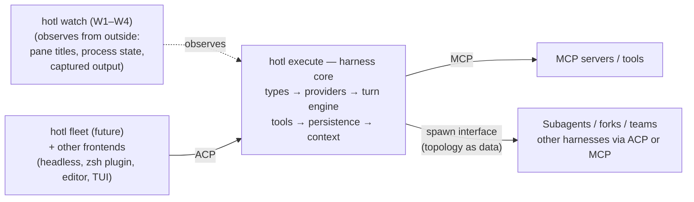

# ARCHITECTURE.md — the harness at a glance

**Product frame (hotl = watch · execute · orchestrate):** this file describes the **execute** capability — the harness behind the bare `hotl` command. The other two capabilities sit *outside* this architecture by design: **watch** (`hotl watch`, the shipped tmux dashboard, layers W1–W4) observes agents from outside the process — pane titles, process state, captured output; never the harness's internal types (merge plan 0002 §scope guards); **orchestrate** (`hotl fleet`, future) will be an ACP *client* of the harness like any other frontend, using the orchestrator-as-client seams pinned in 0001 §M4. One binary hosts all three; only this one has layers.

**Shape: event-log-as-canon, actor-as-serializer, ACP spine.** Session state is a projection of one append-only entry log (a tree via `parent_id`, with a movable leaf); the model transcript and the UI replay are two *projections* of it; compaction is an appended entry that re-points the projection, never a rewrite. One actor per session serializes admission and commits; turn tasks *propose* entries, only the actor commits them.

Status: design settled (see [the blueprint](docs/design-docs/blueprint.md)); implementation not started. This file is the map; the blueprint and the vendored research corpus ([docs/references/agent-framework/](docs/references/agent-framework/README.md)) are the source of record.

## The layers (build order)

From 07 — layers depend upward, with one recorded exception: L3 *triggers* compaction, L6 *implements* it (Consistency #3):

1. **Canonical types** — provider-neutral conversation/message model, structural provenance tags, forward-compat serde from day one.
2. **Provider trait** — `stream(request) → EventStream`; M0 ships one real provider (Anthropic) + a scripted test provider, the second real provider lands M1 to keep the trait honest (D9); central `transformMessages`-style canonicalization pre-pass (M1, with provider #2); catalog deferred (ledger: catalog-later).
3. **Turn engine** — one loop per session; typed steer/queue inbox (durable admission/promotion) on an **out-of-band control lane** so cancel/ask never wedge behind data commands; budgeted recovery; *triggers* compaction (implemented in L6).
4. **Tool system** — typed tools with one erasure boundary; edit cascade; post-mutation format+diagnostics injection; json-repair + schema coercion at the arg boundary; MCP client with deferred loading.
5. **Persistence** — one append-only session log (tree with movable leaf); the model transcript and the UI replay are two *projections* of it, per the Shape header — no second store; shadow-git snapshots for undo.
6. **Context assembly** — byte-stable prefix; AGENTS.md-as-map; auto memory with load budget (loaded in an untrusted-content envelope — Sec #1); **compaction** (typed digest + verbatim tail + last-resort degradation floor so a failed compaction can't brick the session — Sec #10); ephemeral per-turn context block (MOIM).
7. **Headless/protocol surface before TUI** — ACP-shaped contract with permission mediation; `-p`/JSON modes; capability advertisement; shell-plugin mode early, TUI last.

Cross-cutting: in-process hooks primary + Claude-compatible shell-hook adapter **scoped to the events actually used, not the full 35-event schema** (D5) + WASM components as the third-party plugin lane **(gated on the browser milestone, not v0 — D6)**; permission rules + inspector pipeline + kernel sandbox floor (native), on by default — **the floor lands M1; until it exists every exec is individually human-gated and allow-rule persistence is disabled** (r2 R1/R3); spawn interface where topology/depth are data (subagent / fork / teammate).

Compilation targets: **native from day one; WASM (browser) is a gated post-M5 milestone** (D2) — core crates sit behind platform traits (fs/exec/http/clock/storage) throughout so the seam stays clean; browser, when it ships, is a reduced-capability profile where tools requiring unavailable capabilities drop out of the registry (blueprint §WASM, 0001 §Browser milestone).

## The connective planes (from 13)

| Plane | Protocol |
|---|---|
| Agent ↔ tools | MCP |
| Agent ↔ frontend | ACP (Zed's) — the embedding contract |
| Agent ↔ own sub/peer agents | Own spawn interface; agents-as-tools (MCP) / agents-as-providers (ACP) |
| Agent ↔ un-owned peers | A2A — seam reserved, implementation deferred |

## The other two capability stacks (unified layer vocabulary: system-design §Capability namespaces)

- **Watch — W1–W4, shipped** ([system-design §Watch](docs/design-docs/system-design.md); behavior: [product-specs/watch.md](docs/product-specs/watch.md)): observation types + `Surface` trait → surface backends (tmux) → listener (ratatui-free, the non-TUI consumer seam) → Elm TUI; wired by `hotl watch`. Invariants: observe-from-outside; zero shared crates/types with the harness.
- **Orchestrate — O, reserved** ([system-design §Orchestrate](docs/design-docs/system-design.md)): `hotl fleet` will be an ACP client of the harness; its only present footprint is the four M4 orchestrator-as-client seams in [0001](docs/exec-plans/active/0001-harness-build.md); its natural view layer is W3's listener.

## What this system is not

No leader daemon, no marketplace, no telemetry stack, no enterprise config layers, no RAG (flat memory files first). Rationale: [blueprint](docs/design-docs/blueprint.md) §skip list — all re-affirmed for distribution (the harness ships to other owner-operators, not customers: [distribution.md](docs/design-docs/distribution.md)).
