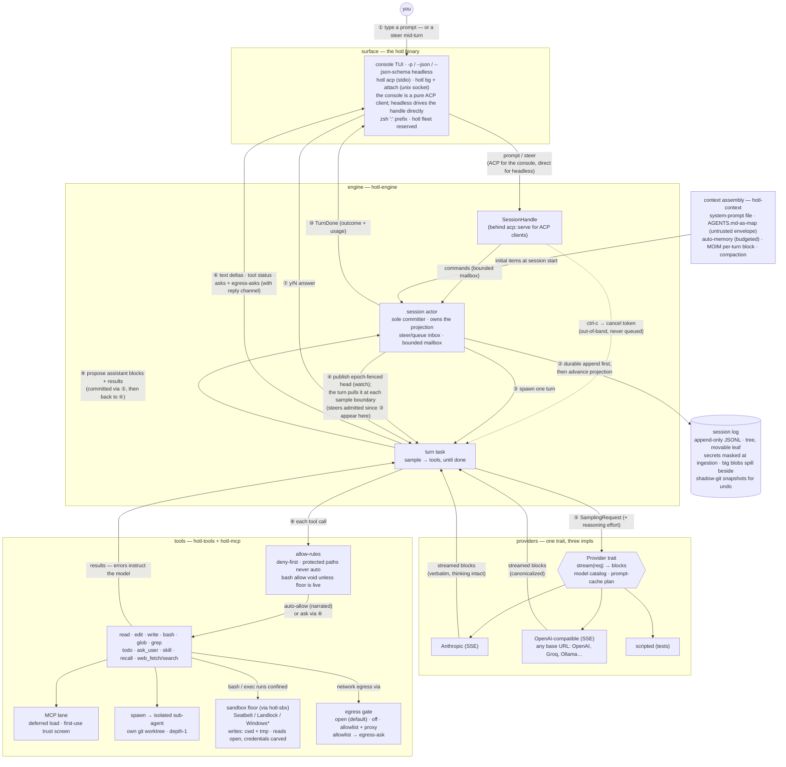

# ARCHITECTURE.md — the harness at a glance

**Product frame (hotl = watch · execute · orchestrate):** this file describes the **execute** capability — the harness behind the bare `hotl` command. The other two capabilities sit _outside_ this architecture by design: **watch** (`hotl watch`, the shipped tmux dashboard, layers W1–W4) observes agents from outside the process — pane titles, process state, captured output; never the harness's internal types; **orchestrate** (`hotl fleet`, future) will be an ACP _client_ of the harness like any other frontend, using the orchestrator-as-client seams. One binary hosts all three; only this one has layers.

**Shape: event-log-as-canon, actor-as-serializer, ACP spine.** Session state is a projection of one append-only entry log (a tree via `parent_id`, with a movable leaf); the model transcript and the UI replay are two _projections_ of it; compaction is an appended entry that re-points the projection, never a rewrite. One actor per session serializes admission and commits; turn tasks _propose_ entries, only the actor commits them.

## The layers (build order)

Layers depend upward, with one recorded exception: L3 _triggers_ compaction, L6 _implements_ it:

1. **Canonical types** — provider-neutral conversation/message model, structural provenance tags, forward-compat serde from day one.
2. **Provider trait** — `stream(request) → EventStream`; two real providers (Anthropic, OpenAI-compatible) + a scripted test provider — a second real provider exists precisely to keep the trait honest; central `transformMessages`-style canonicalization pre-pass; a vendored per-model catalog (context window, pricing, caps, cache-prefix) ships, with the live `/v1/models` endpoint as the runtime authority; a reasoning-effort ladder rides the sampling request.
3. **Turn engine** — one loop per session; typed steer/queue inbox (durable admission/promotion) on an **out-of-band control lane** so cancel/ask never wedge behind data commands; budgeted recovery; _triggers_ compaction (implemented in L6).
4. **Tool system** — typed tools with one erasure boundary; edit cascade; post-mutation format+diagnostics injection; json-repair + schema coercion at the arg boundary; MCP client with deferred loading.
5. **Persistence** — one append-only session log (tree with movable leaf); the model transcript and the UI replay are two _projections_ of it, per the Shape header — no second store; shadow-git snapshots for undo.
6. **Context assembly** — byte-stable prefix; AGENTS.md-as-map; auto memory with load budget (loaded in an untrusted-content envelope); **compaction** (typed digest + verbatim tail + last-resort degradation floor so a failed compaction can't brick the session); ephemeral per-turn context block (MOIM).
7. **Headless/protocol surface before TUI** — ACP-shaped contract with permission mediation; `-p`/JSON modes; capability advertisement; shell-plugin mode early, TUI last.

Cross-cutting: in-process hooks primary + Claude-compatible shell-hook adapter **scoped to the events actually used, not the full 35-event schema** + WASM components as the third-party plugin lane **(deferred until the browser target ships, not v0)**; permission rules + inspector pipeline + kernel sandbox floor (native), on by default — **where the floor cannot be enforced, every exec is individually human-gated and allow-rule persistence is disabled**; a network-egress policy — open by default, else off or allowlist-with-proxy, with an interactive egress-ask; spawn interface where topology/depth are data (subagent / fork / teammate).

Compilation targets: **native from day one; WASM (browser) is a deferred future target** — core crates sit behind platform traits (fs/exec/http/clock/storage) throughout so the seam stays clean; browser, when it ships, is a reduced-capability profile where tools requiring unavailable capabilities drop out of the registry.

> **Seam status (plan 0027, in progress).** The "throughout" above is under construction, not yet true: `hotl-platform` is growing one capability trait per concern with one adapter per platform, driven by the native Windows port. Until that plan closes, read the sentence as the target shape. Tech-debt tracker #4 tracks the port; T3-21 tracks the gap between this claim and the code, and closes with the plan's Task 7b.

## The connective planes

| Plane                       | Protocol                                                               |
| --------------------------- | ---------------------------------------------------------------------- |
| Agent ↔ tools               | MCP                                                                    |
| Agent ↔ frontend            | ACP (Zed's) — the embedding contract                                   |
| Agent ↔ own sub/peer agents | Own spawn interface; agents-as-tools (MCP) / agents-as-providers (ACP) |
| Agent ↔ un-owned peers      | A2A — seam reserved, implementation deferred                           |

## How a prompt flows

One cycle: prompt → actor commits it → turn task samples against the actor's published projection head → deltas stream to the surface → tool calls pass rules/ask and run (bash confined, network egress gated) → results commit → re-read the head (steers woven in) → repeat until done. Every write goes through the actor and hits disk before the projection advances; ctrl-c bypasses the mailbox entirely. One path is not drawn: when the next request won't fit the context window, the turn ends, the actor folds old history into a typed digest (appending a `compaction` entry — the log keeps everything), and respawns a continuation turn at step ③.

```mermaid
flowchart TB
    YOU((you))

    subgraph SURFACE["surface — the hotl binary"]
        CLIENT["console TUI · -p / --json / --json-schema headless<br/>hotl acp (stdio) · hotl bg + attach (unix socket)<br/>the console is a pure ACP client; headless drives the handle directly<br/>zsh ':' prefix · hotl fleet reserved"]
    end

    subgraph ENGINE["engine — hotl-engine"]
        HANDLE["SessionHandle<br/>(behind acp::serve for ACP clients)"]
        ACTOR["session actor<br/>sole committer · owns the projection<br/>steer/queue inbox · bounded mailbox"]
        TURN["turn task<br/>sample → tools, until done"]
    end

    subgraph PROVIDERS["providers — one trait, three impls"]
        P{{"Provider trait<br/>stream(req) → blocks<br/>model catalog · prompt-cache plan"}}
        A["Anthropic (SSE)"]
        O["OpenAI-compatible (SSE)<br/>any base URL: OpenAI, Groq, Ollama…"]
        S["scripted (tests)"]
    end

    subgraph TOOLS["tools — hotl-tools + hotl-mcp"]
        RULES["allow-rules<br/>deny-first · protected paths never auto<br/>bash allow void unless floor is live"]
        T["read · edit · write · bash · glob · grep<br/>todo · ask_user · skill · recall · web_fetch/search"]
        MCP["MCP lane<br/>deferred load · first-use trust screen"]
        SPAWN["spawn → isolated sub-agent<br/>own git worktree · depth-1"]
        SBX["sandbox floor (via hotl-sbx)<br/>Seatbelt / Landlock / Windows*<br/>writes: cwd + tmp · reads open, credentials carved"]
        NET["egress gate<br/>open (default) · off · allowlist + proxy<br/>allowlist → egress-ask"]
    end

    LOG[("session log<br/>append-only JSONL · tree, movable leaf<br/>secrets masked at ingestion · big blobs spill beside<br/>shadow-git snapshots for undo")]
    CTX["context assembly — hotl-context<br/>system-prompt file · AGENTS.md-as-map (untrusted envelope)<br/>auto-memory (budgeted) · MOIM per-turn block · compaction"]

    YOU -->|"① type a prompt — or a steer mid-turn"| CLIENT
    CLIENT -->|"prompt / steer<br/>(ACP for the console, direct for headless)"| HANDLE
    HANDLE -->|"commands (bounded mailbox)"| ACTOR
    HANDLE -.->|"ctrl-c → cancel token<br/>(out-of-band, never queued)"| TURN
    CTX -->|"initial items at session start"| ACTOR
    ACTOR -->|"② durable append first,<br/>then advance projection"| LOG
    ACTOR -->|"③ spawn one turn"| TURN
    ACTOR -->|"④ publish epoch-fenced head (watch);<br/>the turn pulls it at each sample boundary<br/>(steers admitted since ③ appear here)"| TURN
    TURN -->|"⑤ SamplingRequest (+ reasoning effort)"| P
    P --> A
    P --> O
    P --> S
    A -->|"streamed blocks<br/>(verbatim, thinking intact)"| TURN
    O -->|"streamed blocks<br/>(canonicalized)"| TURN
    TURN -->|"⑥ text deltas · tool status ·<br/>asks + egress-asks (with reply channel)"| CLIENT
    CLIENT -->|"⑦ y/N answer"| TURN
    TURN -->|"⑧ each tool call"| RULES
    RULES -->|"auto-allow (narrated)<br/>or ask via ⑥"| T
    T --> MCP
    T --> SPAWN
    T -->|"bash / exec runs confined"| SBX
    T -->|"network egress via"| NET
    T -->|"results — errors instruct the model"| TURN
    TURN -->|"⑨ propose assistant blocks + results<br/>(committed via ②, then back to ④)"| ACTOR
    ACTOR -->|"⑩ TurnDone (outcome + usage)"| CLIENT
```

ACP is already the console's transport — the TUI is a pure ACP client of an in-process `acp::serve`, and `hotl acp` exposes the same contract to external editors; `hotl fleet` (a reserved stub today) will be one more ACP client. `hotl watch` observes from outside this diagram entirely — pane titles, process state, never these internals.

_\* The native-Windows write floor is written but fail-closed; until it is certified, every exec on Windows is individually human-gated._

## The other two capability stacks

- **Watch — W1–W4, shipped:** observation types + `Surface` trait → surface backends (tmux) → listener (ratatui-free, the non-TUI consumer seam) → Elm TUI; wired by `hotl watch`. Invariants: observe-from-outside; zero shared crates/types with the harness.
- **Orchestrate — O, reserved:** `hotl fleet` will be an ACP client of the harness; its only present footprint is the orchestrator-as-client seams; its natural view layer is W3's listener.

## What this system is not

No leader daemon, no marketplace, no telemetry stack, no enterprise config layers, no built-in vector store or RAG-by-default — flat memory files first, with an opt-in `recall` tool for owner-configured retrieval backends. The harness ships to other owner-operators, not customers.
